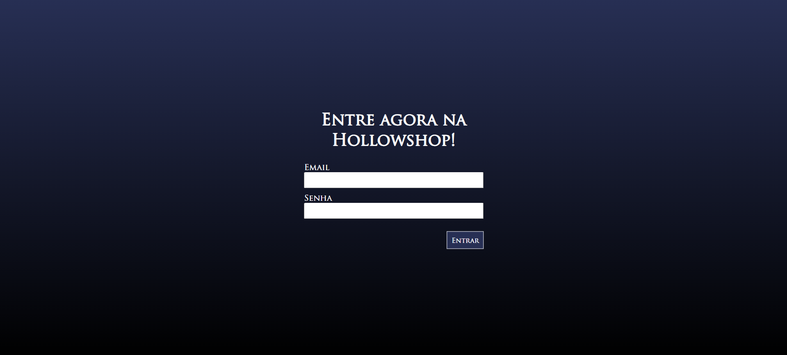
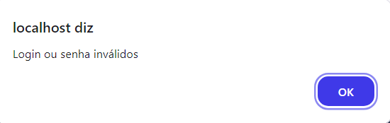
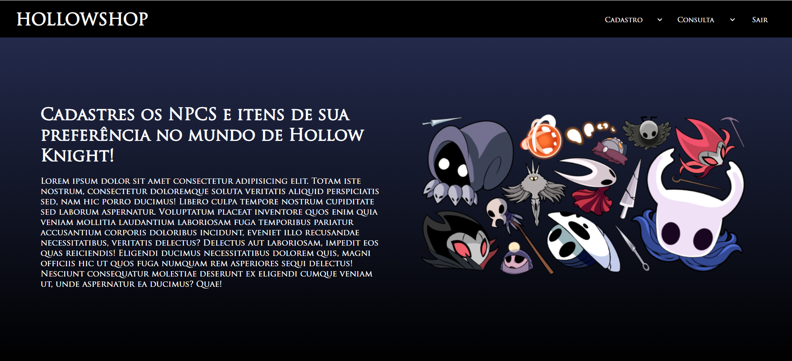
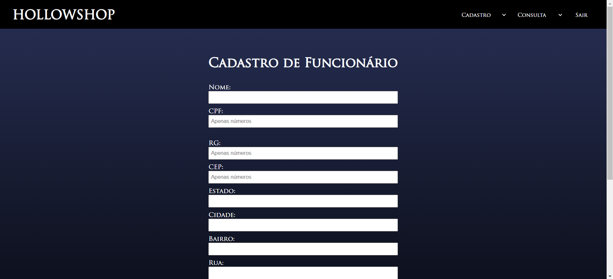
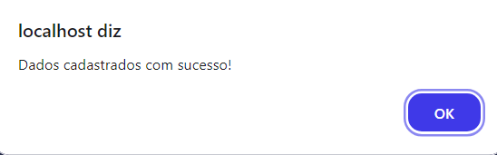
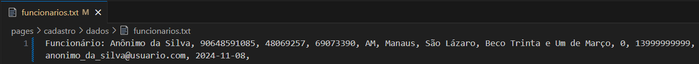

# HOLLOWSHOP
## Desenvolvido para o curso técnico de Informática para Internet na ETEC de Praia Grande
&nbsp;

### Proposta
- Criar um site que faz um sistema de cadastro de clientes, funcionários, fornecedores, produtos e usuários. A tela inicial exibe um login que redireciona para um menu, onde os cadastros e as consultas podem ser realizados. Os dados devem ser armazenados em arquivo .txt em uma pasta "dados", criando um arquivo para cada tipo de cadastro; cada um dos arquivos deve conter todos os cadastros realizados daquele tipo.

### Tela de Login

### Caso o email ou a senha estejam incorretos
- Use "admin@admin" e "admin" respectivamente como email e senha padrão.
&nbsp;

### Menu

### Exemplo de Cadastro: Funcionário

### Cadastro Realizado

### Dados Armazenados
- Os dados são inseridos no diretório "pages/cadastro/dados" após a realização do cadastro.
- **Na imagem:** Nome / CPF / RG / CEP / Estado / Cidade / Bairro / Rua / Número / Celular / Email / Data de Admissão
&nbsp;

