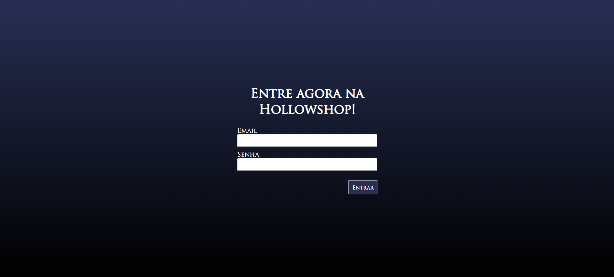
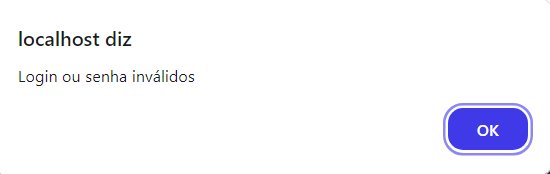
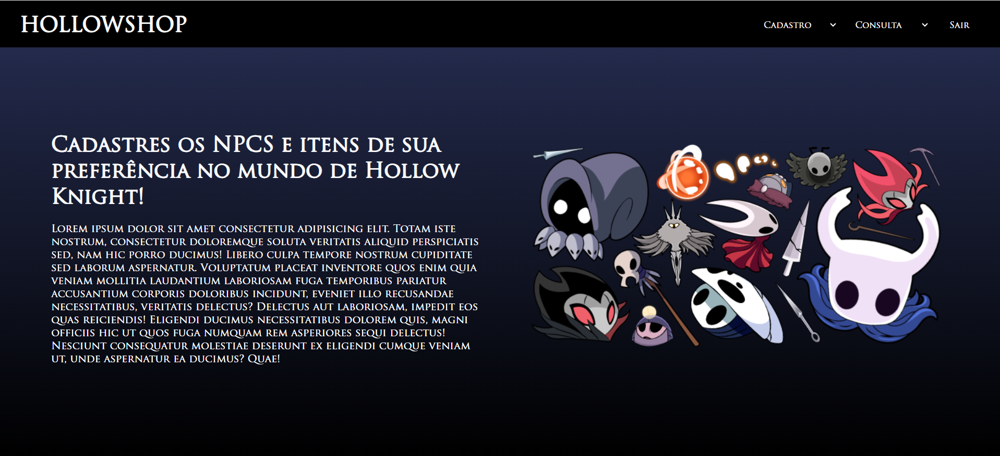
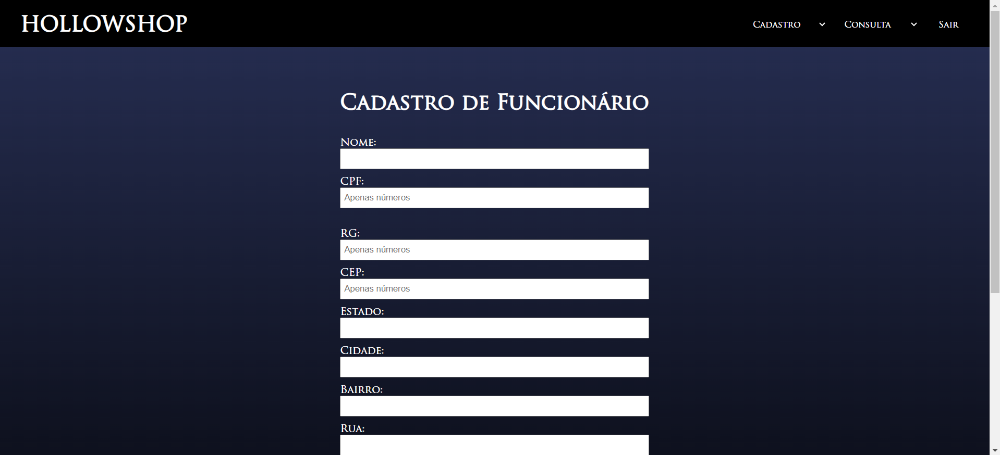
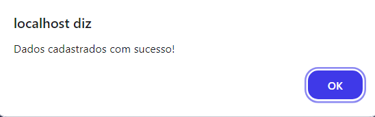
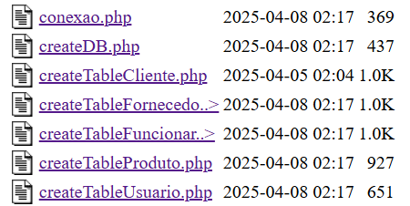

# HOLLOWSHOP
## Desenvolvido para o curso técnico de Informática para Internet na ETEC de Praia Grande
&nbsp;

### Proposta
- Criar um site que faz um sistema de cadastro de clientes, funcionários, fornecedores, produtos e usuários. A tela inicial exibe um login que redireciona para um menu, onde os cadastros e as consultas podem ser realizados. Os dados devem ser armazenados em um banco de dados local, com a possibilidade realizar o CRUD de cada um dos módulos.

### Tela de Login

### Caso o email ou a senha estejam incorretos
- Use "admin@admin" e "admin" respectivamente como email e senha padrão.
&nbsp;

### Menu

### Exemplo de Cadastro: Funcionário

### Cadastro Realizado

### Dados Armazenados
- Os dados são inseridos em um banco de dados local. Exectue todos os arquivos da pasta "config" nesta ordem para criar localmente o banco e fazer os devidos testes:
1. createDB.php
2. conexao.php
3. todos os arquivos de createTable.

&nbsp;

